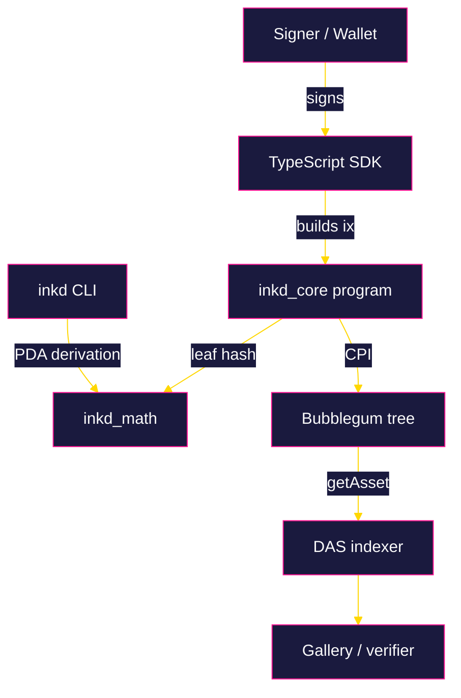

<p align="center">
  
</p>

<p align="center">
  <a href="https://x.com/inkd_fun"></a>
  <a href="https://inkd.fun"></a>
  <a href="https://github.com/inkd-labs/inkd"></a>
  
  
  
  
</p>

# Inkd

> CA: 2uRdYXZcC6WrsL55aNN3Y22wrT6kHYb3QE3J75F4pump

> Once inked, forever proven.

Soulbound attestation protocol on Solana. Compressed, non-transferable on-chain proofs for identity, merit, and credentials.

Paper peels. Ink doesn't. Inkd publishes soulbound, non-transferable credentials as compressed NFTs on Solana, so a wallet's history stops being a receipt and starts being a record.

## Testing

Run the Rust and TypeScript test suites independently:

```bash
# Rust (unit tests live inside inkd_math)
cargo test --workspace

# TypeScript (Jest via ts-jest)
cd sdk && npm test
```

The `tests/` directory contains integration tests that are skipped on
CI because they require a local validator. To run them, start a
local validator, then re-run the suite with `VALIDATOR_URL` set.

## Architecture

The protocol splits into three concerns: a small on-chain program, a
dependency-light math crate shared by both sides, and a TypeScript
client that can be called from any wallet or server.



Accounts are laid out as follows:

| Account | Seeds | Purpose |
|---------|-------|---------|
| `Config` | `config` | Protocol-wide authority, treasury, counters. |
| `Issuer` | `issuer`, slug | A DAO or protocol allowed to mint. |
| `Attestation` | `attestation`, issuer, recipient, credential | A single soulbound credential. |

## Usage

Plan a mint from the SDK. The client is transport-agnostic, so it can
be wired into any Solana web3 library:

```ts
import { InkdClient } from '@inkd/sdk';

const client = new InkdClient({
  cluster: 'mainnet-beta',
  rpcUrl: process.env.SOLANA_RPC_URL ?? 'https://api.mainnet-beta.solana.com',
});

const plan = client.plannedMint({
  issuerSlug: 'inkd',
  recipient: 'So1anaRecipientPubkey',
  credential: 'day-one',
  payloadHash: new Uint8Array(32),
});

console.log(plan.program, plan.seeds.length);
```

Derive PDAs from the command line without running a full node:

```bash
cargo run -p inkd_cli -- issuer inkd
cargo run -p inkd_cli -- attest inkd <recipient> day-one
cargo run -p inkd_cli -- capacity
```

## Features

| Capability | Notes |
|------------|-------|
| Soulbound by construction | Non-transferable at the account layer. Only the issuer can revoke. |
| Compressed storage | Bubblegum-style Merkle trees; per-mint cost measured in fractions of a cent. |
| Issuer scoping | Per-issuer nonces, event emission, and revocation counters. |
| Deterministic leaves | Domain-tagged SHA-256 leaves for stable off-chain indexing. |
| Typed client | A small, transport-agnostic TypeScript SDK for planning and verification. |
| CLI derivation | A single binary to derive issuer and attestation PDAs locally. |

## Installation

Clone the repository and build both the on-chain program and the SDK
locally. The project is published as source; no package registry is
required.

```bash
git clone https://github.com/inkd-labs/inkd.git
cd inkd

# Rust workspace (core program, math helpers, CLI)
cargo check --workspace

# TypeScript SDK
cd sdk && npm install && npm run build
```

### Requirements

| Tool | Minimum version |
|------|-----------------|
| Rust | 1.75 (stable) |
| Solana CLI | 1.18.16 |
| Anchor | 0.30.1 |
| Node.js | 20 LTS |

## Repository Layout

```
inkd/
  programs/
    inkd_core/         core Anchor program
  libs/
    inkd_math/         shared hashing and PDA helpers
  sdk/                 TypeScript client
  cli/                 inkd command-line tool
  tests/               integration suite (skipped on CI)
  scripts/             deploy helpers
```

## Protocol Notes

- Leaves are domain-tagged with `inkd::v1::leaf` to make future
  revisions safe to deploy next to existing trees.
- The default tree geometry is `max_depth = 14`, `max_buffer_size = 64`,
  which gives 16,384 leaves per tree. A single mint costs well under
  one cent on mainnet at current rent.
- `Attestation` accounts carry an explicit `status` byte rather than a
  computed flag; `verify` additionally enforces the expiry window.

## License

Released under the MIT License. See [LICENSE](./LICENSE).
